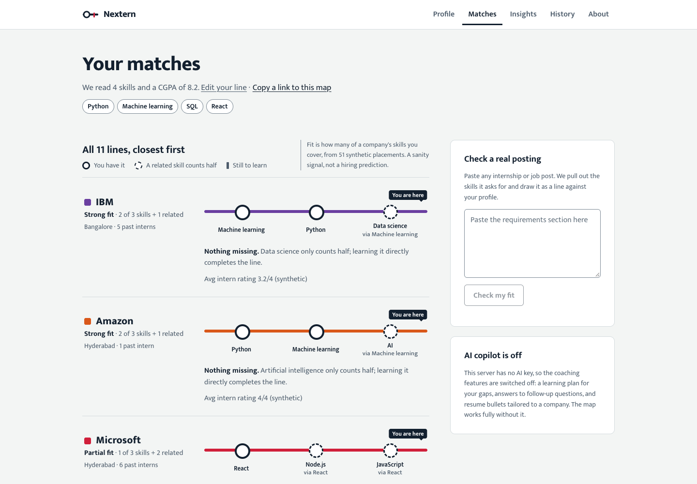
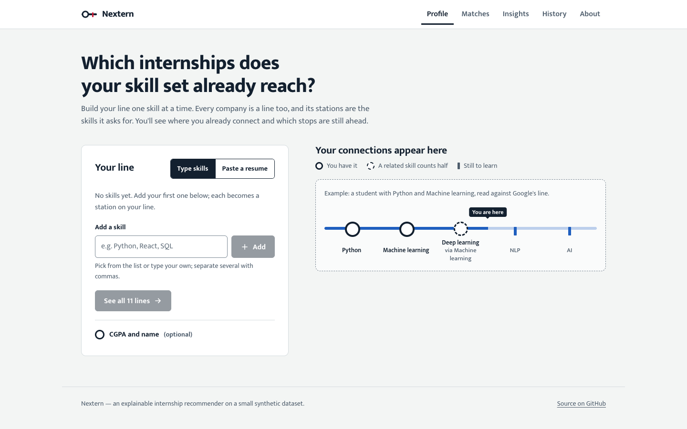
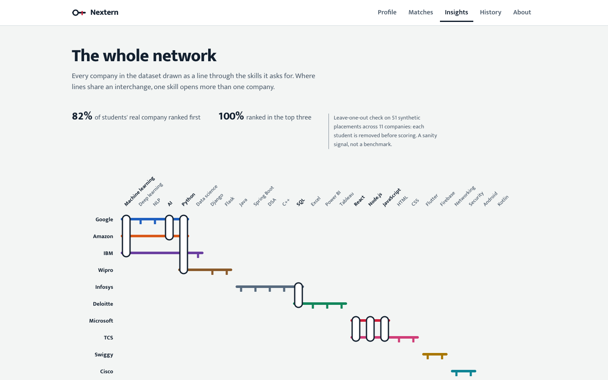

# Nextern — Internship Recommender

**Live demo: [getnextern.onrender.com](https://getnextern.onrender.com)**
_(free tier — the first request after idle can take ~50s to wake)_



An explainable, content-based recommender that matches students to internships. Every
company is described by the skills it has historically required, and a student is scored
by how well they cover them. Nothing is a black box: every match shows the skills that
matched, the ones that count partially through a related skill, and the ones still to learn.

The interface draws that idea literally. Each company is a metro line and its required
skills are the stations: a solid ring is a skill you have, a dashed ring is a related skill
that counts half (`Data science via Machine learning`), and a tick is a stop still ahead.



## What you can do

- **Build your line.** Add skills (with autocomplete from the ontology) and an optional
  CGPA. The top three company lines redraw as you type, and skills the recommender doesn't
  know are flagged instead of being silently ignored.
- **Read every company.** The matches page ranks all 11 companies, closest first, each with
  a fit band (strong / partial / reach), the skill breakdown and the next skill to learn.
  If none of your skills are recognised, it says so rather than ranking guesswork.
- **Check a real posting.** Paste any job description: its required skills are extracted
  and drawn as a line against your saved profile.
- **Share or reopen a map.** Copy a link (`/map?skills=python,sql&cgpa=8.2`), or reopen any
  past map from History. Profile and history stay in your browser.
- **AI copilot** *(optional)*. With an API key on the server, an LLM reads pasted resume
  text into skills you review before anything is ranked, writes a learning plan for the
  gaps in your top matches, answers follow-up questions about your results, and rewords
  resume bullets for a chosen company without inventing experience. It only explains what
  the ontology computed; it never ranks companies itself.



## How it works

1. **Skill ontology.** Every skill is normalised through an alias map (`JS` → JavaScript,
   `ML` → machine learning, `React.js` → React) and grouped into families (`skills.py`), so
   related skills count partially — a React/Node profile gets half credit toward Vue.
2. **Coverage scoring.** For each company, every required skill is matched to the
   student's closest skill: an exact or alias match counts fully, a same-family skill counts
   half. The score is the average coverage, nudged slightly (15%) by how close the
   student's CGPA is to that company's past interns. Coverage maps to a fit band: 70%+ is a
   strong fit, 40%+ partial, anything lower a reach.
3. **Explanation and gaps.** Each match returns three buckets — **matched**, **related**
   (with the family link) and **gap** (skills to learn) — which the UI draws as stations.

> **Why not embeddings?** Static word embeddings were tried and rejected: on short tech
> jargon they scored `react`↔`vue` ≈ 0.05 and `ML`↔`machine learning` ≈ 0.29 — worse than
> the ontology. A transformer model would work but doesn't fit the 512 MB free tier.

### On accuracy

The dataset is small and synthetic — 51 students across 11 companies. A leave-one-out
evaluation (each student removed from the company requirements before being scored) gives
**~82% top-1** and **~100% top-3**. Treat these as a sanity signal that skill coverage is a
sensible ranking, not a production benchmark.

## Project structure

```
.
├── app.py             # Flask: JSON API + serves the built frontend
├── recommender.py     # Scoring engine (coverage, rank, explain, evaluate)
├── skills.py          # Skill ontology: alias resolution + related-skill families
├── copilot.py         # Optional LLM copilot (Anthropic or Gemini)
├── train.py           # Builds the model bundle from the dataset
├── internship_data.csv
├── web/               # React + TypeScript frontend (Vite), builds into static/
├── tests/             # pytest suite for the recommender and the API
├── Dockerfile         # Node stage builds web/, Python stage serves it
└── .github/workflows/ # CI: pytest, plus frontend tests and build
```

## Setup

```bash
pip install -r requirements.txt
```

Build the frontend (Node 20+):

```bash
cd web && npm ci && npm run build
```

Run the app (the model bundle is built automatically on first run if missing):

```bash
python app.py
```

It serves on <http://localhost:7860>. Set `PORT` to change the port and `FLASK_DEBUG=1`
for the reloader. For frontend work, run Flask and then `npm run dev` in `web/`; Vite
proxies `/api` to Flask (set `API_PORT` if Flask isn't on 7860).

### AI copilot

Set `ANTHROPIC_API_KEY` to use Claude (`claude-opus-5-5`) or `GEMINI_API_KEY` for Google's
free tier (the model is discovered at runtime). Override the model with `COPILOT_MODEL`.
Without a key the copilot is switched off and says so; everything else works fully.

## API

All endpoints return JSON with an `ok` flag.

`POST /api/predict`

```json
{ "skills": "python, ml, klingon", "cgpa": 8.5 }
```

```json
{
  "ok": true,
  "recognised": ["python", "machine learning"],
  "unrecognised": ["klingon"],
  "cgpa": 8.5,
  "recommendations": [
    {
      "company": "IBM",
      "confidence": 86,
      "coverage": 83,
      "band": "strong",
      "required_skills": ["data science", "machine learning", "python"],
      "matched_skills": ["machine learning", "python"],
      "related_skills": [{ "skill": "data science", "via": "machine learning" }],
      "gap_skills": [],
      "avg_rating": 3.2,
      "location": "Bangalore",
      "interns": 5
    }
  ]
}
```

| Endpoint | Body | Returns |
|---|---|---|
| `POST /api/predict` | `{skills, cgpa}` | Recognised / unrecognised skills and every company ranked |
| `POST /api/match_jd` | `{skills, jd_text}` | Coverage of a pasted posting with the skill breakdown |
| `GET /api/skills` | — | Every known skill, most common first |
| `POST /api/copilot/extract` | `{text}` | A profile read from resume text, for review |
| `POST /api/copilot/plan` | `{skills, cgpa}` | A learning plan for the top three matches' gaps |
| `POST /api/copilot/ask` | `{skills, cgpa, question, history}` | An answer grounded in the student's matches |
| `POST /api/copilot/tailor` | `{skills, resume_text, company \| jd_text}` | Resume bullets reworded for one target |
| `GET /api/insights` | — | Dataset stats, company profiles, evaluation metrics |
| `GET /api/config` | — | Whether the copilot is on, and which provider |
| `GET /health` | — | Liveness check |

`skills` accepts a comma-separated string or a list; the older `"Technical skills"` /
`"CGPA"` keys still work. Copilot endpoints return 503 when no key is configured.
Requests are rate-limited per IP (predict 60/min, posting check 30/min, copilot 10–20/min).

## Tests

```bash
pip install pytest && pytest -q
cd web && npm test
```

## Docker

```bash
docker build -t nextern .
docker run -p 7860:7860 nextern
```

## Deployment

Deployed on [Render](https://render.com) as a Docker web service via `render.yaml`.
Pushing to `main` redeploys automatically; the image builds the frontend and the model
bundle, so the container starts ready to serve.

## License

MIT — see [LICENSE](LICENSE).
